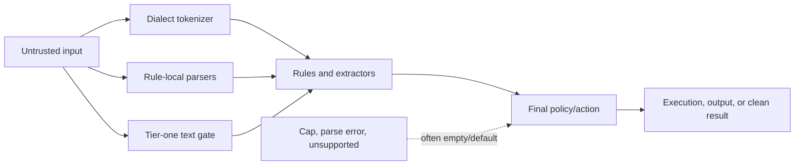

# Security Hardening Proposal: Canonical analysis and completeness

## Decision

Adopt a canonical command/argument representation and a typed analysis outcome,
then migrate consumers in bounded packages. Keep local tactical checks until the
corresponding sink is verified on the new contract.

## Executive Recommendation

The two serious options are Option 1, **strengthen each existing parser and gap
check**, and Option 2, **introduce an owned representation and completeness
contract**. I recommend Option 2 under the current constraints. It addresses the
recurring ownership problem without requiring a flag-day parser rewrite, while
Option 1 remains the tactical bridge for urgent roots.

## Evidence

I inspected the report paths and the current source callers for this review. The
most influential evidence is that several security decisions consume different
representations or silently discard the fact that analysis stopped.

| Evidence | Finding or document | What it establishes |
| --- | --- | --- |
| `repo-0042` | Tier-one completeness gap | A performance prefilter can prevent a configured precise rule from running. |
| `repo-0049` | Install input completeness | Partial or unrecognized operands can disappear from the authoritative install decision. |
| `repo-0129` | Secondary command segmentation | A shell control form can leave an executable segment outside precise analysis. |
| `repo-0336` | Scan enumeration completeness | A requested root or subtree can fail to enter the result as an explicit gap. |
| `repo-0399` | Artifact gap propagation | Member/set inspection gaps can be omitted from the final package verdict. |

Observed: Tirith already has useful `CoverageGap`, shell tokenization, command
facts, artifact inspection, and policy-gap machinery. Observed: not every caller
uses the same representation or propagates the same gap. Inferred: control
ownership is split between performance gates, parsers, individual rules, and
finalizers, making semantic drift likely even after local fixes.

## Current Design And Failure Mode

Untrusted input moves through tier-one strings, dialect tokenizers, rule-local
parsers, package extractors, artifact inspectors, and final policy processing.
Some paths retain raw text, some reconstruct it from argv, and some normalize
again. An error, cap, unsupported form, or rejected record can become an empty
collection that is indistinguishable from “nothing dangerous was found.”

This does not mean every input needs one giant AST. It means every security
decision needs an authoritative representation with preserved raw identity and
an explicit completeness state. We can keep specialized parsers as long as they
attach their result and uncertainty to that contract.

## Desired Invariants

- The command bytes/argv assessed are the bytes/argv executed or forwarded.
- Shell dialect, segments, wrappers, option values, redirections, and byte spans
  have one authoritative representation for rule consumers.
- Every requested subject produces `complete`, `incomplete`, `rejected`, or
  another explicit terminal state; empty/default never implies complete.
- Tier one is a verified superset prefilter, not an independent semantic parser.
- Strict policy cannot finalize an incomplete security-relevant result as Allow.
- Serialized coverage and exit behavior are consistent across CLI, MCP, AI,
  scan, artifact, install, and provenance surfaces.

## Constraints And Non-Goals

We must preserve Rust 1.83, hot-path latency, existing public output through
versioned migrations, and legitimate commands across four shell dialects. The
proposal does not promise a complete shell emulator, execute input to parse it,
or rewrite all rule logic in one PR.

## Before Architecture

[Before diagram](../diagrams/canonical-analysis-before.mmd)

The before view shows semantic decisions branching from several partially
overlapping representations, with incomplete states reaching finalization as
empty results.

## Options

### Option 1: Strengthen local parsers and gap checks

This option keeps current ownership and fixes each affected path in place. Its
strongest case is delivery speed: a focused parser or finalizer test can close a
specific finding without touching unrelated consumers. It also limits migration
risk when two subsystems genuinely have different grammars.

The residual risk is recurrence. Reviewers must prove that tier one, the local
parser, the finalizer, and every output surface agree for each fix. Resource and
memory effects are usually small, but duplicated parsing continues and future
callers can omit the local guard. Rollout is simple and rollback is a focused
revert, provided the local change does not alter a shared format.

[Option 1 diagram](../diagrams/canonical-analysis-local-guards-after.mmd)

| Change | Before | After | Security consequence | Cost |
| --- | --- | --- | --- | --- |
| Parser checks | Inconsistent per caller | Stronger at named sinks | Closes known cases | Future callers can still drift |
| Gap handling | Empty/default possible | Named finalizers reject gaps | Known incomplete paths become visible | Repeated code and output changes |
| Migration | None | Per-sink rollout | Low blast radius | Slow portfolio closure |

### Option 2: Owned command IR and typed outcomes

This option adds two additive foundations: a canonical representation that
preserves raw input and structured interpretation, and an `AnalysisOutcome<T>`
with per-dimension gaps and budgets. Specialized analyzers attach results to the
contract; they do not need to become one parser implementation. Consumers then
migrate in reviewable packages.

The security gain comes from one enforcement boundary for ambiguity and
incompleteness. Performance can improve by parsing once, but that is not assumed;
the IR may retain more spans and facts, and it can add allocations. The
R1-FND completeness and command-IR checkpoints must compare representative hot
commands, long hostile inputs, and
peak allocations against the current path. Reliability improves because error
and cap states remain explicit. Migration is the main cost: adapters, versioned
serialization, and temporary dual paths are required. Rollback keeps adapters
and stops new migrations; it never maps incomplete back to clean.

[Option 2 diagram](../diagrams/canonical-analysis-owned-contract-after.mmd)

| Change | Before | After | Security consequence | Cost |
| --- | --- | --- | --- | --- |
| Input identity | Reconstructed in consumers | Raw plus structured identity | Assessed and used input can be bound | New core types and adapters |
| Completeness | Caller-specific booleans/defaults | Typed outcome and gaps | Incomplete cannot masquerade as clean | Schema and UI migration |
| Parsing | Repeated and divergent | One shared IR plus specialized facts | Less semantic drift | Hot-path benchmark required |
| Rollout | Local patches | Additive consumer migration | Tactical protections stay active | Temporary dual paths |

## Comparison

| Dimension | Option 1: local guards | Option 2: owned contract |
| --- | --- | --- |
| Security | Improves known sinks; medium recurrence risk | Improves known sinks and future ownership; residual specialized-parser risk |
| Performance | Usually neutral, source-derived | Unknown direction; parse reuse versus retained state, benchmark required |
| Memory | Usually neutral | Likely small regression from IR/gap retention; measure peak allocations |
| Reliability | Improves named errors | Improves system-wide error truth; adapter bugs during migration |
| Operability | Low change | New coverage diagnostics and schema-version monitoring |
| Migration | Lowest | Highest, but incremental and reversible |

## Recommendation

I recommend Option 2 with Option 1 as a tactical bridge. Option 1 becomes the
better final choice only where source review proves a truly local grammar with no
shared consumer or recurrence pattern. A measured hot-path regression beyond the
agreed threshold would justify a smaller IR, not a return to silent ambiguity.

## Evidence Coverage And Residual Risk

| Evidence | Effect under Option 2 | Tactical fix still required | Residual risk |
| --- | --- | --- | --- |
| `repo-0042` — tier-one gap | Addresses ownership | Yes, migrate fast path and test every configured rule | Generated table can drift without parity tests |
| `repo-0049` — install completeness | Addresses representation/gaps | Yes, manager-specific operand parsing | External manager grammar changes |
| `repo-0129` — command segmentation | Addresses representation | Yes, dialect-specific separator support | Unsupported shell constructs remain incomplete |
| `repo-0336` — scan enumeration | Addresses gap contract | Yes, collection errors and symlinks | Filesystem races require secure I/O |
| `repo-0399` — artifact gap propagation | Addresses gap contract | Yes, set/member finalizers | Consumers can ignore fields until migrated |

## Migration And Rollout

Within R1-FND, implement typed completeness before the canonical command IR.
Reference-migrate scan, artifact, and MCP consumers to the outcome contract;
reference-migrate extract/engine to the IR. Then move P0/P1 install,
command/rule, hook, ecosystem, and gateway consumers through R1-ART and R1-CMD.
R2 finishes P2 consumers and R3 finishes reliability consumers. Keep
output adapters and dual-read serialization through one release window. Stop
rollout if a consumer cannot express its legitimate compatibility behavior
without collapsing an incomplete state.

## Validation Plan

Use parser/executor differential fixtures for four shell dialects, property
tests for span and equality laws, fuzzing for token/option/cap boundaries, and
golden human/JSON/exit outputs. Benchmark hot short commands, long benign input,
deep wrapper chains, broad scans, and artifact gaps. Exact thresholds are an
open decision before the R1-FND completeness/IR checkpoint.

## Internal Implementation Workstreams

- R1-FND: completeness and command IR; R1-ART/R1-CMD: P0/P1 consumers;
- R2-CMP/R2-CMD/R2-NET: remaining P2 artifact, command, MCP, and scan consumers;
- R3-CORE/R3-CI/R3-INT: reliability consumers and final convergence.

The complete order and package gates are in
[`../implementation/stacked-pr-plan.md`](../implementation/stacked-pr-plan.md).

## Open Questions

- What latency/allocation regression is acceptable for the hot command path?
- Which serialized coverage surfaces require a full release compatibility
  window rather than an additive optional field?
- Which unsupported shell constructs should block by default versus warn under
  an explicit policy?
