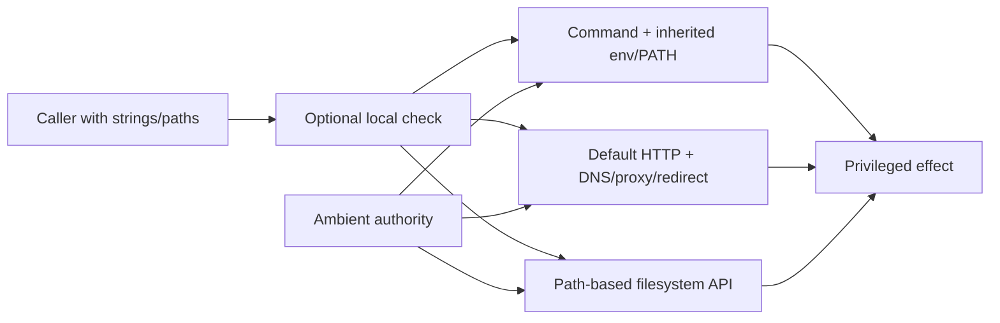

# Security Hardening Proposal: Capability-owned privileged effects

## Decision

Consolidate child execution, network egress, and contained filesystem mutation
behind small APIs that accept already validated identities and return typed,
bounded outcomes. Migrate sinks individually and retain local guards until each
sink is revalidated.

## Executive Recommendation

Option 1 is **validate locally before each privileged call**. Option 2 is
**require a trusted executable, guarded client, or contained directory handle**.
I recommend Option 2. It removes ambient PATH, DNS, proxy, and pathname authority
from the call sites while keeping the architecture in-process and reversible.

## Evidence

| Evidence | Finding or document | What it establishes |
| --- | --- | --- |
| `repo-0018` | Trusted child boundary | A security-analysis helper can execute a program selected from ambient PATH and environment. |
| `repo-0014` | Connect-time egress boundary | Preflight destination checks do not bind the address and redirects used by the actual client. |
| `repo-0040` | State-root deletion boundary | Metadata can influence a deletion target without a root-owned handle. |
| `repo-0271` | Repository writer boundary | A repository-controlled path can redirect a configuration write. |
| `repo-0397` | Atomic-writer contract | A generic atomic writer mixes intentional write-through and containment semantics. |

Observed: process, HTTP, and file APIs are invoked from many security features.
Observed: useful checks exist, but they are not required by the dangerous API
boundary. Inferred: ambient authority lets new callers bypass the intended check
without an obvious type or review failure.

## Current Design And Failure Mode

A caller often receives a string program, URL, or `PathBuf`, performs a local
check, and later invokes `Command`, an HTTP client, or filesystem mutation. The
operating system resolves identity again at use time. PATH, startup variables,
DNS, redirects, proxies, symlinks, reparse points, and path replacement can
therefore change the object between the check and the effect.

## Desired Invariants

- Security operations spawn only an authenticated absolute executable with an
  allowlisted environment and bounded process tree/output.
- Every network hop enforces the same destination policy at connection time,
  including redirects, proxies, IPv4, and IPv6.
- Repository/state mutation occurs relative to a validated directory handle;
  final/intermediate links and replacement races cannot escape it.
- Callers cannot select an unguarded fallback when a capability is unavailable.
- Every effect returns a typed outcome that records timeout, cap, identity,
  durability, and cleanup failures.

## Constraints And Non-Goals

We must support legitimate installed tools, enterprise networking through an
explicit policy, Unix and Windows filesystems, and Rust 1.83. This proposal does
not create a general broker service, grant ambient capability tokens to plugins,
or claim that a validation object is immutable when the OS cannot bind it.

## Before Architecture

[Before diagram](../diagrams/effect-capabilities-before.mmd)

## Options

### Option 1: Strengthen checks at each call site

Each caller resolves an absolute program, validates every URL hop, or
canonicalizes and checks its path immediately before use. This is attractive for
one-off effects and keeps public APIs stable. It adds little memory or deployment
cost and is easy to roll back.

The main concern is that check and use remain separate, and the definition of a
trusted program, forbidden destination, or contained path can drift. Reliability
also remains caller-owned: some children are killed but not reaped, some bodies
are capped after buffering, and some writes are atomic but follow links.

[Option 1 diagram](../diagrams/effect-capabilities-local-guards-after.mmd)

| Change | Before | After | Security consequence | Cost |
| --- | --- | --- | --- | --- |
| Validation | Optional/divergent | Mandatory per named caller | Closes known paths | Repeated implementation and review |
| Use-time binding | Usually absent | Best-effort recheck | Narrows races | OS identity may still change |
| Rollout | None | Local | Small blast radius | Slow, recurrence-prone migration |

### Option 2: Capability-owned effect APIs

Build three small effect boundaries: a trusted child supervisor, a guarded HTTP
client, and contained transactional I/O. Their constructors consume policy and
produce values that the effect method requires. A string program, default client,
or bare path is not accepted at the security-sensitive API.

This does not eliminate every OS race, but it moves ownership to the closest
available binding: absolute/provenanced executables plus minimal environment;
connect-time address selection and per-hop redirects; directory handles and
handle-relative operations. Resource costs come from streaming buffers, DNS
state, locks, and extra fsyncs. Benchmarks must measure child startup, common
HTTP fetches, and state/config write latency. Reliability improves through one
kill/reap, cap, retry, and durability contract, though cross-platform code is
more complex. Migration is incremental and rollback leaves migrated consumers
unavailable rather than unguarded.

[Option 2 diagram](../diagrams/effect-capabilities-owned-after.mmd)

| Change | Before | After | Security consequence | Cost |
| --- | --- | --- | --- | --- |
| Child authority | Program string + ambient env | Trusted executable + supervisor | Removes PATH/startup authority | Tool discovery migration |
| Network authority | URL + default client | Guarded per-hop client | Enforces actual destination | Proxy/CDN compatibility work |
| Filesystem authority | Bare path | Root handle + contained operation | Narrows traversal/symlink races | Platform code and fsync latency |
| Failure | Ad hoc | Typed bounded outcome | No silent fallback | API changes |

## Comparison

| Dimension | Option 1: local validation | Option 2: owned capabilities |
| --- | --- | --- |
| Security | Improves named calls; ambient bypass remains possible | Removes most ambient authority from migrated calls |
| Performance | Usually neutral | Extra resolution, streaming, locks, fsync; measure per effect |
| Memory | Neutral | Bounded buffers/caches; predictable but nonzero |
| Reliability | Caller-specific | Shared cleanup, cap, retry, and durability contract |
| Operability | Low | New diagnostics and explicit trusted/proxy configuration |
| Migration | Lowest | Cross-platform incremental migration |

## Recommendation

I recommend Option 2. Option 1 is appropriate only for a genuinely isolated
effect whose semantics do not recur and whose OS identity can be bound locally.
If enterprise proxy or custom-tool compatibility cannot be represented safely,
the rollout should stop for an explicit product decision rather than add an
ambient bypass.

## Evidence Coverage And Residual Risk

| Evidence | Effect under Option 2 | Tactical fix still required | Residual risk |
| --- | --- | --- | --- |
| `repo-0018` — child trust | Addresses | Yes, every direct spawn migrates separately | Explicit trusted-path config can be misconfigured |
| `repo-0014` — egress binding | Addresses | Yes, each client/redirect/proxy contract | Compromised allowed public origin remains trusted |
| `repo-0040` — state-root deletion | Addresses | Yes, checkpoint metadata and purge semantics | Platform filesystem limitations |
| `repo-0271` — repo writer | Addresses | Yes, each writer preserves format/force behavior | Intentional symlink workflows must migrate |
| `repo-0397` — writer contract | Addresses | Yes, split contained versus write-through APIs | Wrong API selection remains review risk |

## Migration And Rollout

Within R1-FND, implement trusted child supervision, contained Unix/Windows I/O,
and guarded egress, then migrate P0/P1 callers through R1-ART, R1-OUT, and
R1-PLT. R2 finishes package/install, network, state, checkpoint, policy/trust,
setup, MCP, and service consumers at P2. R3 closes reliability consumers. Keep
allowlists explicit and source-qualified. Release schema changes additively;
restart mixed-version processes when stable-lock protocols change.

## Validation Plan

Use fake PATH tools/startup variables, output floods, child/grandchild deadlines,
fake DNS/redirect/proxy servers, IPv4/IPv6 destination tables, final/intermediate
symlinks, Windows reparse points, directory-swap races, failure injection, and
durability checks. Benchmarks compare trusted spawn, guarded fetch, and atomic
state/config writes under representative and adversarial workloads.

## Internal Implementation Workstreams

- R1-FND with R1-ART/R1-OUT/R1-PLT: owned effects and P0/P1 consumers;
- R2-IO/R2-NET/R2-SUP: remaining security consumer migrations;
- R3-CORE/R3-PLT/R3-INT: reliability, portability, and convergence.

See [`../implementation/stacked-pr-plan.md`](../implementation/stacked-pr-plan.md).

## Open Questions

- Which non-system executable locations may be explicitly trusted, and by whom?
- Which proxy/CDN redirect patterns are supported without weakening metadata and
  non-global destination denial?
- What fsync and network-filesystem durability guarantee is part of the product
  contract on each platform?
