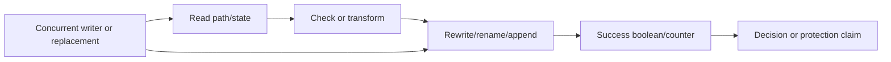

# Security Hardening Proposal: Proof-carrying security state

## Decision

Replace aggregate booleans, unlocked read-modify-write, and provisional state
with versioned state machines, stable locks, transactional publication, and
per-dimension coverage evidence.

## Executive Recommendation

Option 1 is **add local locks, counters, and checks**. Option 2 is **model the
security state and its evidence explicitly**. I recommend Option 2. It lets the
product state what was actually enforced and makes invalid transitions visible,
while local locks remain useful inside the owned transaction.

## Evidence

| Evidence | Finding or document | What it establishes |
| --- | --- | --- |
| `repo-0033` | Containment overlap truth | A backend can report enforcement even when an allow root defeats a deny root. |
| `repo-0044` | Provisional security history | A blocked attempt can poison state used by later decisions. |
| `repo-0196` | Audit generation consistency | Tail, count, and head can be derived from different file generations. |
| `repo-0258` | Per-dimension containment | One aggregate resource flag cannot describe partial enforcement. |
| `repo-0343` | Taint transaction integrity | Concurrent append/clear or corruption can lose or clean security state. |
| `repo-0469` | Scan failure accounting | Coverage gaps can exist while failure counters/output remain clean. |

Observed: several stores already use atomic writes or locks locally, and scan
coverage has explicit gap types. Observed: not every transition uses a stable
lock or records the same generation/dimension. Inferred: security state is often
treated as mutable data rather than an evidence-backed transition, so a caller
can overclaim success without lying at the type level.

## Current Design And Failure Mode

State owners include audit logs, receipts, taint/session/pending stores,
checkpoints, policy/trust files, caches, ThreatDB publication, and OS containment
plans. A lock may be tied to the file that is later renamed, readers can reopen a
different generation, a writer may snapshot then overwrite a concurrent update,
and an aggregate Boolean can claim more than the backend applied.

## Desired Invariants

- A success state names the generation, dimensions, and evidence it represents.
- Incomplete, corrupt, stale, provisional, unsupported, and degraded are not
  aliases for absent or successful.
- A stable lock covers the complete read/validate/transform/publish transition.
- Atomic publication is durable and preserves last-known-good state until the
  new generation validates.
- Blocked/provisional events do not become executed history or authorization.
- Containment and resource coverage are per dimension and derived only from
  controls actually applied.
- Readers and renderers consume one consistent generation or report drift.

## Constraints And Non-Goals

We must support mixed-version migrations, crash recovery, Windows and Unix
locking/rename semantics, and no-telemetry operation. The proposal does not
promise distributed exactly-once delivery, a database rewrite for every JSONL
store, or a single state format across unrelated domains.

## Before Architecture

[Before diagram](../diagrams/proof-state-before.mmd)

## Options

### Option 1: Local locks, counters, and validation

Add the missing lock, identity check, counter increment, or backend Boolean at
each affected function. This option is attractive for small independent stores
and can close many races with limited schema impact. Resource and memory cost is
usually neutral; lock contention is local and measurable.

Its weakness is transition ownership. A lock on a replaceable inode, a counter
not consumed by every output, or another aggregate Boolean can recreate the
defect. Cross-process crash recovery and mixed generations remain caller-specific.
Rollback is easy for local code, but serialized states can become ambiguous.

[Option 1 diagram](../diagrams/proof-state-local-checks-after.mmd)

| Change | Before | After | Security consequence | Cost |
| --- | --- | --- | --- | --- |
| Concurrency | Missing/partial lock | Local stable lock where added | Closes known lost updates | Other owners may differ |
| Coverage | Aggregate/missing counter | More fields/checks | Improves named output | Semantic drift remains |
| Recovery | Ad hoc | Path-specific | Better local behavior | No shared transition contract |

### Option 2: Versioned state machines and evidence

Define owner-specific state machines over common transactional primitives. A
state generation includes the evidence needed by its consumer: coverage
dimensions, input identity, sequence/version, completeness, signature/durability,
or delivery status. A stable lock covers the full transition; new generations
validate before atomic durable publication; readers detect replacement or use
the same handle/generation.

The security effect is that success cannot be represented without its proof.
Memory increases modestly for metadata, retained last-known-good generations, and
bounded queues. Reliability improves through crash recovery and explicit stale
or corrupt states, but migration is more demanding: schemas must be additive,
old readers need a compatibility window, and mixed-version writers may require a
process restart. Operability improves because degraded dimensions and truncation
are visible. Rollback keeps dual-read support and selects the last validated
generation; it never rewrites a corrupt state as empty.

[Option 2 diagram](../diagrams/proof-state-versioned-after.mmd)

| Change | Before | After | Security consequence | Cost |
| --- | --- | --- | --- | --- |
| Transition | Loose functions | Owner state machine under stable lock | Invalid transitions rejected | Schema and migration work |
| Success | Boolean/counter | Generation plus evidence/dimensions | Protection claims become falsifiable | More metadata |
| Publish | Append/replace variants | Validate, fsync, atomic publish | Last-known-good survives failure | I/O latency |
| Read | Reopen/current path | Same handle/generation or drift | Consistent decision basis | Compatibility adapters |

## Comparison

| Dimension | Option 1: local checks | Option 2: proof-carrying state |
| --- | --- | --- |
| Security | Closes known races/claims | Makes invalid success states harder to represent |
| Performance | Usually neutral | Locks/fsync/metadata; benchmark per owner |
| Memory | Neutral | Small metadata, bounded queues, last-known-good retention |
| Reliability | Local improvement | Crash recovery and consistent generations |
| Operability | More errors | Explicit degraded dimensions and truncation |
| Migration | Lowest | Additive schema and mixed-version coordination |

## Recommendation

I recommend Option 2 for security state and coverage owners, while using Option
1 for a truly isolated counter or lock that has no serialized or cross-consumer
meaning. Option 1 becomes preferable when source review proves the state never
crosses a process, file generation, output schema, or authorization decision.

## Evidence Coverage And Residual Risk

| Evidence | Effect under Option 2 | Tactical fix still required | Residual risk |
| --- | --- | --- | --- |
| `repo-0033` — containment overlap | Addresses dimensions/evidence | Yes, backend overlap validation | OS policy expressiveness varies |
| `repo-0044` — provisional history | Addresses transitions | Yes, reorder decision/persistence | Session semantics migration |
| `repo-0196` — audit generation | Addresses consistent handle/generation | Yes, rotation protocol | External log rotation compatibility |
| `repo-0258` — containment dimensions | Addresses representation | Yes, each backend applies/reports controls | Runtime probes remain platform-specific |
| `repo-0343` — taint transaction | Addresses stable lock/corruption | Yes, append/clear/read migration | Mixed old/new writers |
| `repo-0469` — scan accounting | Addresses evidence/output | Yes, every caller consumes gaps | Client schema migration |

## Migration And Rollout

Within R1-FND, implement typed coverage, contained Unix/Windows I/O, and stable
state transactions; R1-PLT then migrates P0/P1 state and containment owners. R2
finishes P2 consumers and R3 finishes reliability consumers and convergence.
Use dual-read/single-write, versioned records, last-known-good preservation, and
process restart requirements where stable-lock protocols change.

## Validation Plan

Use deterministic interleavings, multi-process barriers, rename/replacement
races, torn/corrupt records, crash points around fsync/rename, low disk,
signature/key removal, stale sequence, per-dimension OS probes, incomplete scan
outputs, and mixed-version fixtures. Benchmark lock contention, fsync latency,
queue memory, checkpoint/audit throughput, and containment startup.

## Internal Implementation Workstreams

- R1-FND/R1-PLT: shared state, coverage, I/O, and P0/P1 owners;
- R2-CMP/R2-IO/R2-NET: remaining P2 state, containment, ThreatDB, policy, and MCP owners;
- R3-CORE/R3-PLT/R3-INT: P3 state reliability and final convergence ledger.

See [`../implementation/stacked-pr-plan.md`](../implementation/stacked-pr-plan.md).

## Open Questions

- Which state writers can coexist across versions, and which require restart?
- What durability guarantee is required on network filesystems and Windows?
- Which containment dimensions are mandatory per supported mode and platform?
