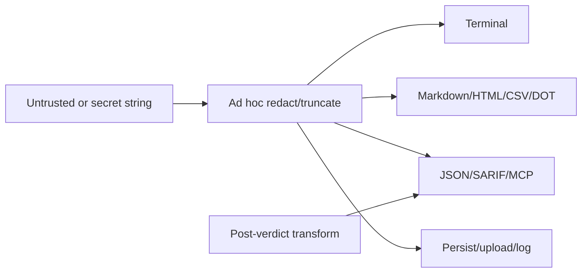

# Security Hardening Proposal: Typed safe output and secret lifecycle

## Decision

Keep raw identity values separate from secret-bearing and human-display values.
Apply redaction before truncation or persistence, encode at the final format
boundary, and reanalyze the exact transformed structured output before forwarding.

## Executive Recommendation

Option 1 is **add the correct sanitizer or encoder to each known sink**. Option 2
is **introduce typed raw, secret, redacted, and format-safe values with explicit
encoders**. I recommend Option 2, using Option 1 for urgent sinks while the types
and streaming sanitizer land.

## Evidence

| Evidence | Finding or document | What it establishes |
| --- | --- | --- |
| `repo-0029` | Audit secret lifecycle | Truncation can occur before complete credential redaction and persistence/upload. |
| `repo-0046` | Terminal-state overflow | A capped control sequence can leave the scanner in a clean rather than suspicious state. |
| `repo-0058` | Structured-key collision | Sanitization can change key identity after schema validation and overwrite data. |
| `repo-0161` | Markdown data encoding | Untrusted audit data survives into Markdown table cells without format encoding. |

Observed: a capable terminal sanitizer and many local sanitizers already exist.
Observed: sinks differ across terminal, Markdown, HTML, CSV, DOT, JSON, SARIF,
audit, webhook, and MCP structured data. Inferred: the central problem is not one
missing regex; it is loss of type and transformation order at format boundaries.

## Current Design And Failure Mode

Values travel as ordinary strings. A caller may redact, truncate, sanitize,
serialize, display, persist, upload, or transform them in a different order. A
terminal sanitizer is sometimes reused as if it encoded Markdown or JSON. In
structured MCP output, values and keys can change after schema/verdict checks.
Streaming control state can reset at chunk or cap boundaries.

## Desired Invariants

- Secrets are removed from complete input before truncation, persistence,
  upload, or error formatting.
- Raw identity remains available only where the algorithm requires it; a human
  sink requires a display-safe value.
- Terminal, Markdown, HTML, CSV, DOT, JSON, SARIF, shell, and URL encoding are
  distinct operations.
- Streaming sanitizer state survives chunk splits, invalid UTF-8, and overflow.
- Any structured mutation is followed by collision detection, schema
  validation, and security reanalysis of the exact forwarded representation.
- Machine formats own stdout and report write/flush failures as nonzero.

## Constraints And Non-Goals

We must preserve readable human output, stable/versioned machine schemas, bounded
work, and legitimate Unicode. The proposal does not remove all control-looking
characters from raw JSON, promise every renderer has the same display model, or
store a “sanitized” string as the sole identity value.

## Before Architecture

[Before diagram](../diagrams/safe-output-before.mmd)

## Options

### Option 1: Patch every known sink

Add the correct sanitizer or encoder next to each terminal print, Markdown cell,
CSV field, URL error, or structured transformation. This option is the quickest
route for high-risk sinks, causes almost no memory overhead, and keeps changes
locally reviewable.

Its weakness is proof and recurrence. A reviewer must audit every field and
transformation order, and new sinks again receive an ordinary string. Local
snapshots can prove named paths but cannot make an unsafe call difficult to
express. Rollback is simple; portfolio completion is slow and conflict-heavy.

[Option 1 diagram](../diagrams/safe-output-local-encoders-after.mmd)

| Change | Before | After | Security consequence | Cost |
| --- | --- | --- | --- | --- |
| Known sinks | Raw/ad hoc | Correct local encoder | Closes named injection/leak | Repeated code and audit |
| Transform order | Caller choice | Patched at named paths | Fixes known ordering | Future drift remains |
| Type safety | None | None | No compile-time boundary | Low migration cost |

### Option 2: Typed values and format-specific encoders

Introduce raw/secret/redacted/display-safe wrappers, one streaming terminal
state machine, and explicit format encoders. Human render APIs accept safe values
or perform the conversion at the boundary. Persistence/upload APIs require
redacted values when confidentiality applies. Structured transformations return
errors on key collisions and trigger post-transform schema/security checks.

The security gain is ownership and ordering. Performance cost comes from
streaming state, range merging, and occasional second-pass analysis; memory is
bounded by explicit byte/hit budgets. Reliability improves because write/flush,
truncation, and collision states are typed. Migration is broad but mostly
mechanical, so it should be isolated after semantic packages to reduce conflicts.
Rollback preserves raw values and adapters; it cannot restore a raw terminal or
secret persistence fallback.

[Option 2 diagram](../diagrams/safe-output-typed-values-after.mmd)

| Change | Before | After | Security consequence | Cost |
| --- | --- | --- | --- | --- |
| Value identity | Plain strings | Raw/secret/redacted/display-safe types | Unsafe use becomes explicit | API/snapshot migration |
| Encoding | Mixed helpers | Format-specific final boundary | Prevents context confusion | More encoder APIs |
| Streaming | Chunk-local/ad hoc | One bounded state machine | Split/overflow bypasses close | State and benchmark work |
| Structured transforms | Post-verdict mutation | Collision/schema/reanalysis | Forwarded object is assessed | Additional bounded pass |

## Comparison

| Dimension | Option 1: sink patches | Option 2: typed boundaries |
| --- | --- | --- |
| Security | Strong for named sinks, weaker for future callers | Stronger ownership and transformation order |
| Performance | Neutral | Small/unknown cost; streaming and second pass measured |
| Memory | Neutral | Bounded state and hit/range storage |
| Reliability | Local | Shared cap, collision, write/flush outcomes |
| Operability | Snapshot changes only | New diagnostics for incomplete/unsafe transforms |
| Migration | Lowest | Broad but mechanical and reversible |

## Recommendation

I recommend Option 2. Option 1 should close urgent persistent-secret and active
terminal sinks before the full migration. If typed wrappers create excessive
ergonomic friction, the acceptable simplification is a small final-sink renderer
API—not continued use of unconstrained strings across formats.

## Evidence Coverage And Residual Risk

| Evidence | Effect under Option 2 | Tactical fix still required | Residual risk |
| --- | --- | --- | --- |
| `repo-0029` — audit secret lifecycle | Addresses ordering | Yes, full command redaction before append/spool | Unknown secret formats require updates |
| `repo-0046` — terminal overflow | Addresses streaming state | Yes, discard-through-terminator semantics | Terminal-specific interpretations |
| `repo-0058` — key collision | Addresses typed transform | Yes, reject collision and revalidate schema | Upstream clients may rely on ambiguous keys |
| `repo-0161` — Markdown encoding | Addresses format ownership | Yes, renderer contract and cell encoder | External renderer behavior varies |

## Migration And Rollout

Within R1-FND, implement raw/secret/redacted/format-safe value types and the
streaming terminal state; R1-OUT fixes persistent secrets and migrates P0/P1
sinks. R2 finishes P2 human/export/MCP/output-stream sinks and R3 closes
reliability contracts. Keep JSON/SARIF schema changes versioned and machine
values structured. Run sink-level snapshots after semantic commit groups to
reduce conflicts inside each PR.

## Validation Plan

Use every byte split through UTF-8 and escape sequences, cap overflow, C0/C1,
CSI/OSC/APC/DCS, hyperlinks, bidi/tags/zero-width, Markdown raw tags/entities,
CSV formula prefixes, DOT strings, JSON keys, serializer/write/flush failures,
and secret formats across audit/spool/webhook/license/public receipts. Measure
hot rendering, long output, many leaves, and peak retained state.

## Internal Implementation Workstreams

- R1-FND/R1-OUT: renderer contract, persistent secrets, and P0/P1 sinks;
- R2-NET/R2-IO: remaining security output, MCP, and audit migrations;
- R3-CLI/R3-INT: machine-output reliability and convergence.

See [`../implementation/stacked-pr-plan.md`](../implementation/stacked-pr-plan.md).

## Open Questions

- Which human surfaces may intentionally preserve color from trusted UI code?
- What version transition is acceptable for one-document CLI JSON envelopes?
- Which Markdown/HTML renderers are officially supported for incident and audit
  reports?
